# Execution Plan - Business Youthful Color Refresh

> **Status: Approved on 2026-08-25.** This plan preserves the Business layout and changes only relevant theme colors.

## Detailed Analysis Summary

### Transformation Scope

- **Transformation type**: Isolated presentation-layer enhancement in the existing React/Vite application.
- **Primary change**: Replace the Business theme's warm brown and beige token system with `#3368A0`, `#66A3BF`, `#C8DFDB`, `#F2EFE7`, and accessible derived values.
- **Primary component**: `src/templates/business/business.css`.
- **Supporting verification**: `src/themeAccessibility.test.ts` and existing Business, application, lint, build, and formatting checks.
- **Unaffected boundaries**: JSX structure, layout, typography, spacing, content, routes, interactions, assets, Engineering, deployment, and dependencies.

### Change Impact Assessment

| Impact area           | Assessment                                                                      |
| --------------------- | ------------------------------------------------------------------------------- |
| User-facing change    | Yes - Business receives a new cool-color visual system in light and dark modes. |
| Structural change     | No - selectors, components, DOM structure, and layout rules remain intact.      |
| Data model change     | No.                                                                             |
| API or route change   | No.                                                                             |
| Dependency change     | No.                                                                             |
| NFR impact            | Accessibility contrast and theme isolation require regression verification.     |
| Infrastructure change | No.                                                                             |

### Component Relationships

- **Primary component**: Business theme stylesheet.
- **Direct consumer**: Existing Business shell and section components through scoped CSS variables and selectors.
- **Shared component impact**: None; shared React components keep their contracts and structure.
- **Dependent verification**: Theme accessibility safeguards parse the Business light and dark root tokens.
- **Change priority**: Patch-level, presentation-only update.

### Risk Assessment

- **Risk level**: Low.
- **Rollback complexity**: Easy; restore the previous Business token declarations and color-only rules.
- **Testing complexity**: Simple; focused palette and contrast checks plus the existing regression suite.
- **Primary risks**: Insufficient text contrast, weak dark-mode surface separation, missed legacy warm colors, or accidental edits outside the Business scope.

## Workflow Visualization

```mermaid
flowchart TD
    Start(["Approved Requirements"])

    subgraph INCEPTION["INCEPTION PHASE"]
        WD["Workspace Detection<br/><b>COMPLETED</b>"]
        RE["Reverse Engineering<br/><b>REUSED</b>"]
        RA["Requirements Analysis<br/><b>COMPLETED</b>"]
        US["User Stories<br/><b>SKIP</b>"]
        WP["Workflow Planning<br/><b>REVIEW</b>"]
        AD["Application Design<br/><b>SKIP</b>"]
        UG["Units Generation<br/><b>SKIP</b>"]
    end

    subgraph CONSTRUCTION["CONSTRUCTION PHASE"]
        FD["Functional Design<br/><b>SKIP</b>"]
        NFRA["NFR Requirements<br/><b>SKIP</b>"]
        NFRD["NFR Design<br/><b>SKIP</b>"]
        ID["Infrastructure Design<br/><b>SKIP</b>"]
        CG["Code Generation<br/><b>EXECUTE</b>"]
        BT["Build and Test<br/><b>EXECUTE</b>"]
    end

    subgraph OPERATIONS["OPERATIONS PHASE"]
        OPS["Operations<br/><b>PLACEHOLDER</b>"]
    end

    Start --> WD
    WD --> RE
    RE --> RA
    RA --> US
    US --> WP
    WP --> AD
    AD --> UG
    UG --> FD
    FD --> NFRA
    NFRA --> NFRD
    NFRD --> ID
    ID --> CG
    CG --> BT
    BT --> OPS
    OPS --> End(["Complete"])

    style WD fill:#4CAF50,stroke:#1B5E20,stroke-width:3px,color:#fff
    style RE fill:#4CAF50,stroke:#1B5E20,stroke-width:3px,color:#fff
    style RA fill:#4CAF50,stroke:#1B5E20,stroke-width:3px,color:#fff
    style WP fill:#FFA726,stroke:#E65100,stroke-width:3px,stroke-dasharray:5 5,color:#000
    style US fill:#BDBDBD,stroke:#424242,stroke-width:2px,stroke-dasharray:5 5,color:#000
    style AD fill:#BDBDBD,stroke:#424242,stroke-width:2px,stroke-dasharray:5 5,color:#000
    style UG fill:#BDBDBD,stroke:#424242,stroke-width:2px,stroke-dasharray:5 5,color:#000
    style FD fill:#BDBDBD,stroke:#424242,stroke-width:2px,stroke-dasharray:5 5,color:#000
    style NFRA fill:#BDBDBD,stroke:#424242,stroke-width:2px,stroke-dasharray:5 5,color:#000
    style NFRD fill:#BDBDBD,stroke:#424242,stroke-width:2px,stroke-dasharray:5 5,color:#000
    style ID fill:#BDBDBD,stroke:#424242,stroke-width:2px,stroke-dasharray:5 5,color:#000
    style CG fill:#4CAF50,stroke:#1B5E20,stroke-width:3px,color:#fff
    style BT fill:#4CAF50,stroke:#1B5E20,stroke-width:3px,color:#fff
    style OPS fill:#BDBDBD,stroke:#424242,stroke-width:2px,stroke-dasharray:5 5,color:#000
    style Start fill:#CE93D8,stroke:#6A1B9A,stroke-width:3px,color:#000
    style End fill:#CE93D8,stroke:#6A1B9A,stroke-width:3px,color:#000
    style INCEPTION fill:#BBDEFB,stroke:#1565C0,stroke-width:3px,color:#000
    style CONSTRUCTION fill:#C8E6C9,stroke:#2E7D32,stroke-width:3px,color:#000
    style OPERATIONS fill:#FFF59D,stroke:#F57F17,stroke-width:3px,color:#000
    linkStyle default stroke:#333,stroke-width:2px
```

### Text Alternative

1. Workspace Detection and Requirements Analysis are complete; current reverse-engineering artifacts are reused.
2. User Stories, Application Design, Units Generation, and all conditional per-unit design stages are skipped.
3. Workflow Planning is at its review gate.
4. Code Generation will create and execute a focused color-token implementation plan.
5. Build and Test will run focused accessibility checks and the complete project quality suite.
6. Operations remains a placeholder; no deployment is authorized.

## Workflow Planning Checklist

- [x] Load current reverse-engineering and approved requirements context.
- [x] Assess scope, component relationships, risk, and rollback.
- [x] Determine executed and skipped stages.
- [x] Define the package change sequence and quality gates.
- [x] Validate Mermaid IDs, edges, labels, styles, Markdown tables, and the text alternative.
- [x] Obtain explicit execution-plan approval.

## Phases to Execute

### Inception

- [x] Workspace Detection - Existing brownfield React/Vite application and Business style boundary confirmed.
- [x] Reverse Engineering - Reuse current artifacts because this request does not alter the documented architecture.
- [x] Requirements Analysis - Exact palette and preservation constraints approved.
- [x] User Stories - SKIP; direct acceptance criteria cover this isolated visual enhancement.
- [x] Workflow Planning - APPROVED; the focused plan was approved on 2026-08-25.
- [x] Application Design - SKIP; no new component, service, method, or dependency boundary.
- [x] Units Generation - SKIP; one cohesive styling unit requires no decomposition.

### Construction

- [x] Functional Design - SKIP; no schema, algorithm, or business logic.
- [x] NFR Requirements - SKIP; approved contrast, isolation, compatibility, and maintainability requirements are sufficient.
- [x] NFR Design - SKIP; existing CSS scoping and automated contrast mechanisms remain suitable.
- [x] Infrastructure Design - SKIP; deployment architecture is unchanged.
- [ ] Code Generation - EXECUTE; plan and implement the scoped palette mapping and focused assertions.
- [ ] Build and Test - EXECUTE; run focused and complete verification and document reproducible instructions.

### Operations

- [ ] Operations - PLACEHOLDER; no deployment, publication, or monitoring change is requested.

## Package Change Sequence

1. Update `src/templates/business/business.css` so light and dark Business tokens and direct color declarations use the new palette or accessible derived values.
2. Update `src/themeAccessibility.test.ts` only as needed to assert palette identity, legacy-color removal, and representative contrast without changing the existing accessibility mechanism.
3. Run focused Business and accessibility tests before the complete suite, lint, TypeScript/Vite build, formatting, stale-color scan, and diff validation.
4. Update only mandatory AI-DLC plan, summary, state, audit, and Build and Test artifacts.

## Success Criteria

- The Business theme visibly uses all four supplied colors across its light and dark systems.
- No active legacy brown, bronze, beige, or warm-ink Business color remains.
- Layout, DOM structure, typography, spacing, content, routes, interactions, assets, and responsive behavior are unchanged.
- Business text, button, hover, focus, and essential boundary contrasts satisfy the approved thresholds.
- Engineering, shared components, dependencies, and the two-theme selector remain unchanged.
- Focused tests, the complete Vitest suite, ESLint, TypeScript/Vite build, Prettier, stale-color scan, and `git diff --check` pass.

## Extension Compliance

| Extension              | Status   | Rationale                                                      |
| ---------------------- | -------- | -------------------------------------------------------------- |
| Security Baseline      | Disabled | Opted out during Requirements Analysis for this CSS-only work. |
| Property-Based Testing | Disabled | Opted out because no algorithmic or stateful logic is added.   |

## Content Validation

| Check              | Result                                                                       |
| ------------------ | ---------------------------------------------------------------------------- |
| Mermaid syntax     | Valid flowchart direction, alphanumeric IDs, valid edges, and quoted labels. |
| Mermaid fallback   | Included as the ordered text alternative above.                              |
| Markdown structure | Headings, lists, tables, links, code spans, and checkboxes are balanced.     |
| ASCII diagrams     | Not used.                                                                    |
