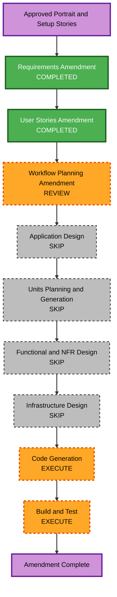

# Execution Plan - Neutral and Business Layout Variety

> **Neutral portrait and cross-platform setup workflow amendment approved on 2026-08-02.** The approved and implemented layout-variety, runtime-selector, and student-friendly workflows remain the foundation.

## Analysis Summary

### Transformation Scope

- **Project type**: Brownfield React and Vite static portfolio.
- **Transformation type**: Presentation enhancement within one application package.
- **Primary changes**: Preserve the delivered layout structures and runtime selector while making Neutral a student learning journal and Business a student project showcase with accurate project-owned media.
- **Affected components**: Shared project type and data, three local project covers, the shared selector, Neutral and Business Shell, Hero, About, and Projects components, scoped CSS, tests, and active AI-DLC documentation.
- **Unaffected boundaries**: App-owned runtime state, template registry, Engineering presentation, APIs, backend, deployment workflow, hash-routing model, and shared section order.

### Impact Assessment

| Area | Impact |
|---|---|
| User-facing experience | Improves selector clarity, Business spacing, project imagery, and student-oriented Neutral and Business presentation |
| Application architecture | Low; all work remains inside existing data and template component boundaries |
| Data model | Minor compatible extension; each project receives a local image and alternative text |
| API and infrastructure | None |
| Accessibility and responsive behavior | Semantic selector state, image alternatives, contrast, case-label clearance, image framing, and header fit require verification |
| Dependencies | No additions |

### Component Relationships

- **Primary components**: `src/types/portfolio.ts`, `src/data/projects.ts`, the shared selector, and existing Neutral and Business presentation components.
- **Shared dependencies**: Project data, template registry, App-owned route and layout state, Chakra UI, scoped CSS variables, and local Vite assets.
- **Dependent components**: App interaction tests, portfolio data tests, responsive visual checks, and active AI-DLC documentation.
- **Critical invariant**: Engineering, runtime selection, persistence, routes, layout mode, content actions, and color mode must remain stable.

### Risk Assessment

- **Risk level**: Medium.
- **Primary risks**: Inaccurate or oversized project covers, weak dark-mode contrast, image cropping, cramped Business case labels, selector state becoming unclear without the check icon, and style leakage into Engineering.
- **Rollback complexity**: Easy because changes remain scoped to local assets, shared project fields, existing template components, and CSS.
- **Testing complexity**: Moderate due to three templates, two color modes, responsive image behavior, selector accessibility, and Engineering regression checks.

## Workflow Visualization

```mermaid
flowchart TD
    Start["Approved Student-Friendly Stories"]

    subgraph INCEPTION["INCEPTION PHASE"]
        WD["Workspace Detection<br/>COMPLETED"]
        RE["Reverse Engineering<br/>REUSED"]
        RA["Requirements Analysis<br/>AMENDED"]
        US["User Stories<br/>AMENDED"]
        WP["Workflow Planning<br/>REVIEW"]
        AD["Application Design<br/>SKIP"]
        UG["Units Planning and Generation<br/>SKIP"]
    end

    subgraph CONSTRUCTION["CONSTRUCTION PHASE"]
        FD["Functional Design<br/>SKIP"]
        NFRA["NFR Requirements<br/>SKIP"]
        NFRD["NFR Design<br/>SKIP"]
        ID["Infrastructure Design<br/>SKIP"]
        CG["Code Generation<br/>EXECUTE"]
        BT["Build and Test<br/>EXECUTE"]
    end

    End["Implementation Complete"]

    Start --> WD --> RE --> RA --> US --> WP --> AD --> UG
    UG --> FD --> NFRA --> NFRD --> ID --> CG --> BT --> End

    style Start fill:#CE93D8,stroke:#6A1B9A,stroke-width:3px,color:#000
    style End fill:#CE93D8,stroke:#6A1B9A,stroke-width:3px,color:#000
    style WD fill:#4CAF50,stroke:#1B5E20,stroke-width:3px,color:#fff
    style RE fill:#4CAF50,stroke:#1B5E20,stroke-width:3px,color:#fff
    style RA fill:#4CAF50,stroke:#1B5E20,stroke-width:3px,color:#fff
    style US fill:#4CAF50,stroke:#1B5E20,stroke-width:3px,color:#fff
    style WP fill:#FFA726,stroke:#E65100,stroke-width:3px,stroke-dasharray:5 5,color:#000
    style AD fill:#BDBDBD,stroke:#424242,stroke-width:2px,stroke-dasharray:5 5,color:#000
    style UG fill:#BDBDBD,stroke:#424242,stroke-width:2px,stroke-dasharray:5 5,color:#000
    style FD fill:#BDBDBD,stroke:#424242,stroke-width:2px,stroke-dasharray:5 5,color:#000
    style NFRA fill:#BDBDBD,stroke:#424242,stroke-width:2px,stroke-dasharray:5 5,color:#000
    style NFRD fill:#BDBDBD,stroke:#424242,stroke-width:2px,stroke-dasharray:5 5,color:#000
    style ID fill:#BDBDBD,stroke:#424242,stroke-width:2px,stroke-dasharray:5 5,color:#000
    style CG fill:#FFA726,stroke:#E65100,stroke-width:3px,stroke-dasharray:5 5,color:#000
    style BT fill:#FFA726,stroke:#E65100,stroke-width:3px,stroke-dasharray:5 5,color:#000
    style INCEPTION fill:#BBDEFB,stroke:#1976D2,color:#000
    style CONSTRUCTION fill:#C8E6C9,stroke:#388E3C,color:#000
    linkStyle default stroke:#333,stroke-width:2px
```

### Text Alternative

1. Workspace Detection and reused Reverse Engineering remain complete.
2. Requirements Analysis and User Stories are amended and approved for the student-friendly refresh.
3. Workflow Planning is under review; Application Design remains skipped because existing component contracts are sufficient.
4. Units, Functional Design, NFR stages, and Infrastructure Design remain skipped.
5. The existing Code Generation unit receives one focused implementation step, followed by Build and Test.

## Stage Decisions

### Inception

- [x] Workspace Detection - Completed using the existing brownfield workspace.
- [x] Reverse Engineering - Reused current architecture, component, stack, and dependency artifacts.
- [x] Requirements Analysis - Student-friendly refresh amendment approved.
- [x] User Stories - Student-friendly refresh amendment approved.
- [x] Workflow Planning - Student-friendly refresh amendment approved.
- [x] Application Design - **SKIP**. Existing shared project data and template component boundaries are sufficient; no new component contract or state owner is needed.
- [x] Units Planning and Generation - **SKIP**. The work is one cohesive UI implementation unit in one package.

### Construction

- [x] Functional Design - **SKIP**. Adding project media fields and presentation copy introduces no complex business logic.
- [x] NFR Requirements - **SKIP**. Accessibility, responsive image, asset-size, contrast, and dependency constraints are already approved.
- [x] NFR Design - **SKIP**. Existing scoped CSS, semantic menu, focus, image, and reduced-motion patterns are sufficient.
- [x] Infrastructure Design - **SKIP**. Deployment and hosting do not change.
- [ ] Code Generation - **IMPLEMENTED AND VERIFIED; AWAITING APPROVAL**. Added local project covers, project media fields, selector and spacing fixes, student-friendly Neutral and Business copy and styles, and focused tests.
- [ ] Build and Test - **EXECUTE**. Run automated checks, production build, asset review, contrast checks, and desktop/mobile visual verification.

## Package Change Sequence

1. Create and optimize three cohesive local covers for Coursework and Certificates, Program Analyzer, and Java Resume Application.
2. Extend the shared project type and records with image and alternative-text fields.
3. Remove the selector check icon while preserving selected-row styling and semantic checked behavior.
4. Update Neutral components to use project-owned media and student learning-journal language.
5. Update Business components to use project-owned media, student-showcase language, and responsive case-label clearance.
6. Refine scoped Neutral and Business styles, update focused tests and active documentation, then run integrated verification.

The sequence is mostly sequential because project assets and fields must exist before both templates can consume them. Neutral and Business presentation work can then proceed independently before shared regression and visual checks.

## Deliverables

- One code-generation plan with step-level checkboxes.
- Three optimized project-specific local covers with meaningful alternative text.
- Updated Neutral learning-journal presentation.
- Updated Business student-project-showcase presentation.
- Focused automated regression coverage.
- Selector state without a visible tick and Business case-label spacing.
- Synchronized active AI-DLC artifacts.
- Required Build and Test instructions and verification summary.

## Success Criteria

- Neutral reads as a friendly learning journal and Business reads as an organized student project showcase.
- All three projects use accurate project-owned local covers in Neutral and Business.
- The selector has no visible check icon while retaining clear semantic selection, and Business case labels have responsive inline clearance.
- Engineering, routes, layout modes, actions, runtime selection, persistence, and shared content behavior remain unchanged.
- No new runtime dependency, route model, backend, or infrastructure is introduced.
- Tests, ESLint, TypeScript, production build, and responsive visual checks pass.

## Neutral Portrait and Cross-Platform Setup Workflow Amendment

### Scope and Impact

- **Transformation type**: Small presentation and student-documentation enhancement within one existing application package.
- **Primary files**: `src/templates/neutral/NeutralHero.tsx`, `README.md`, focused rendering assertions, and active AI-DLC artifacts.
- **User-facing impact**: Neutral's portrait becomes proportionate to the other themes; student authors receive complete operating-system-aware onboarding.
- **Architecture, data, API, and infrastructure impact**: None.
- **Dependencies**: No additions.
- **Risk level**: Low; the visual change is isolated and the documentation can be reviewed independently.
- **Rollback complexity**: Easy; both deliverables are in-place changes to existing files.
- **Testing complexity**: Simple automated regression plus desktop/mobile portrait inspection and documentation command review.

### Current Amendment Workflow

### Text Alternative

1. The approved Requirements and User Stories amendments feed the current Workflow Planning review.
2. Application Design, Units, Functional Design, NFR Design, and Infrastructure Design are skipped.
3. One existing Code Generation unit receives a focused step for the portrait, README, tests, and evidence.
4. Build and Test follows code generation and completes the amendment.

### Stage Decisions

- [x] Workspace Detection and Reverse Engineering - **REUSE**. The current brownfield architecture and component inventory remain accurate.
- [x] Requirements Analysis - **COMPLETED**. NBV-21 through NBV-23 and NBV-NFR-11 through NBV-NFR-12 are approved.
- [x] User Stories - **COMPLETED**. `NBV-US-01` and `NBV-US-04` own the new outcomes.
- [x] Workflow Planning - **APPROVED**. The focused sequence was approved on 2026-08-02.
- [x] Application Design - **SKIP**. Existing Hero and documentation boundaries are sufficient; no new component contract or method is needed.
- [x] Units Planning and Generation - **SKIP**. The work remains one cohesive unit in one package.
- [x] Functional Design - **SKIP**. No business logic, model, parser, or workflow behavior changes.
- [x] NFR Requirements and Design - **SKIP**. Responsive framing, documentation usability, accessibility, and dependency constraints are already explicit and use existing patterns.
- [x] Infrastructure Design - **SKIP**. Hosting, GitHub Actions, and deployment remain unchanged.
- [ ] Code Generation - **IMPLEMENTED AND VERIFIED; AWAITING APPROVAL**. The portrait, README, focused assertion, and evidence updates are complete.
- [ ] Build and Test - **EXECUTE**. Verify tests, lint, build, portrait rendering, README commands, links, and Markdown structure.

### Change Sequence

1. Record the current Neutral, Engineering, and Business portrait geometries and README baseline.
2. Constrain the Neutral portrait with a stable responsive ratio and centered medium width while preserving its image, caption, copy, and actions.
3. Rewrite the README onboarding flow with operating-system-specific prerequisites followed by shared clone and ZIP setup paths.
4. Add focused regression assertions, review official installation references, and validate copyable commands and Markdown.
5. Run automated checks and representative desktop/mobile visual inspection, then synchronize active AI-DLC evidence.

### Deliverables and Success Criteria

- Neutral uses the existing portrait in a centered medium panel comparable to Business, with no stretching, overflow, or first-viewport domination.
- README onboarding covers Windows 10/11, macOS, Ubuntu/Debian, Fedora, and Arch-based Linux plus concise WSL and ChromeOS Linux notes.
- Students can follow either Git clone or ZIP download instructions through local development, editing, verification, updates, and troubleshooting.
- Existing template behavior, Engineering, Business, routes, content, dependencies, and deployment remain unchanged.
- Focused tests, the complete suite, ESLint, TypeScript production build, responsive portrait inspection, Markdown validation, and link review pass.

## Content Validation

| Check | Result |
|---|---|
| Mermaid node IDs | Alphanumeric and unique |
| Mermaid edges and subgraphs | Balanced and syntactically valid |
| Mermaid text alternative | Included |
| Markdown structure | Valid headings, checklists, tables, and code fence |

## Extension Compliance

| Extension | Status | Rationale |
|---|---|---|
| Security Baseline | Disabled | Confirmed during Requirements Analysis. |
| Property-Based Testing | Disabled | Confirmed during Requirements Analysis. |
