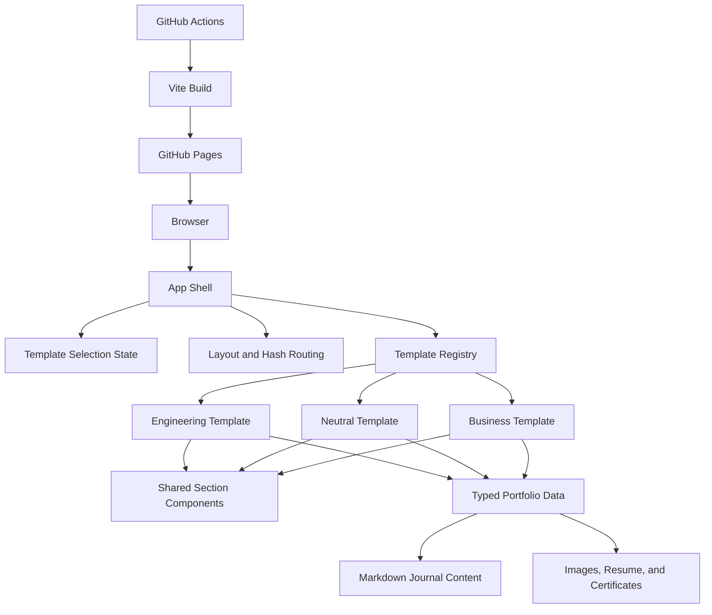
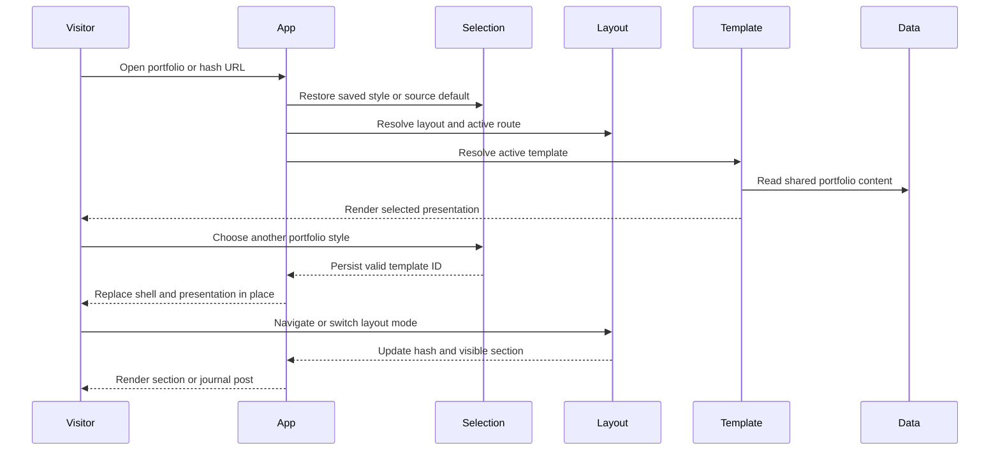

# System Architecture

## System Overview

This project is a static React 19 and TypeScript portfolio built with Vite. `PortfolioApp` combines a three-template registry, browser-persisted runtime style selection, typed portfolio data, hash-based layout routing, local journal routing, and shared navigation. Engineering, Neutral, and Business consume the same data model while supplying distinct shells and selected section components. Chakra UI supplies responsive primitives, custom CSS variables define template themes, and GitHub Actions deploys the Vite build to GitHub Pages.

## Architecture Diagram

### Text Alternative

The browser loads the App shell. App restores a valid visitor style or uses the student-configured default, resolves navigation and hash routing, and renders the selected registry entry. All three templates consume shared typed data, Markdown journal content, and bundled assets. GitHub Actions runs Vite and deploys the output to GitHub Pages.

## Component Descriptions

### Application Package
- **Purpose**: Static student portfolio frontend.
- **Responsibilities**: Own runtime template selection, resolve journal routes, layout mode, navigation state, and visible section rendering.
- **Dependencies**: React, Chakra UI, template registry, layout hook, typed data, and browser history APIs.
- **Type**: Application.

### Template Registry
- **Purpose**: Provide swappable presentation strategies.
- **Responsibilities**: Register Engineering, Neutral, and Business; resolve valid IDs; fall back to Engineering; and expose complete shell, journal, chapter, and section mappings.
- **Dependencies**: Template definitions and shared `SectionId` contract.
- **Type**: Application model.

### Engineering Template
- **Purpose**: Present technical and career evidence in a structured format.
- **Responsibilities**: Map all sections to the baseline shared components.
- **Dependencies**: Shared section components and portfolio data.
- **Type**: Presentation.

### Neutral Template
- **Purpose**: Present multidisciplinary evidence through a balanced editorial format.
- **Responsibilities**: Supply a magazine masthead, editorial Hero, About, and Projects while reusing compatible shared sections.
- **Dependencies**: Shared data, shared components, media, and Neutral CSS variables.
- **Type**: Presentation.

### Business Template
- **Purpose**: Present evidence through a professional consulting-report format.
- **Responsibilities**: Supply a report header and contents rail plus executive Hero, About, and Projects while reusing compatible shared sections.
- **Dependencies**: Shared data, shared components, media, and Business CSS variables.
- **Type**: Presentation.

### Runtime Template Selection
- **Purpose**: Let each visitor choose how the same portfolio content is presented.
- **Responsibilities**: Validate stored IDs, use `src/data/template.ts` as the no-preference default, persist valid choices, and expose one shared selector in every shell header.
- **Dependencies**: Browser local storage, the template registry, Chakra Menu, and React state.
- **Type**: Application behavior.

### Layout and Journal Routing
- **Purpose**: Support continuous, section-routed, and local-post experiences without a server router.
- **Responsibilities**: Persist layout mode, parse hashes, render one or all sections, and resolve `#/journal/{slug}` routes.
- **Dependencies**: Browser history, local storage, navigation configuration, and journal utilities.
- **Type**: Application behavior.

### UI Provider and Shared UI
- **Purpose**: Provide theming and reusable presentation primitives.
- **Responsibilities**: Configure Chakra, color mode, actions, section shells, logo marks, tooltips, and toasts.
- **Dependencies**: Chakra UI, Emotion, next-themes, and React Icons.
- **Type**: Shared UI support.

### GitHub Pages Workflow
- **Purpose**: Build and publish the static portfolio.
- **Responsibilities**: Install Node dependencies, derive the repository base path, run the build, and deploy `dist/`.
- **Dependencies**: GitHub Actions and Vite.
- **Type**: Deployment automation.

## Data Flow

### Text Alternative

A visitor opens the site, App restores a valid saved style or uses the source default, resolves the URL, and renders the matching template over shared data. A style change replaces the presentation while route and layout state stay owned by App. Navigation updates the URL and visible content. Local journal hashes render a dedicated post page; other section hashes render one or all template sections depending on layout mode.

## Integration Points

- **External APIs**: None.
- **Databases**: None.
- **Third-party Services**: GitHub and GitHub Pages, LinkedIn, WordPress, YouTube embeds, Google Fonts, and the visitor's email client through `mailto:`.
- **Browser APIs**: History, hash changes, local storage for layout and template preferences, scrolling, and media/dialog interactions.

## Infrastructure Components

- **CDK Stacks**: None.
- **Deployment Model**: GitHub Actions builds a static Vite artifact and deploys it to GitHub Pages.
- **Networking**: Public static hosting with no API server, private network, or database.
