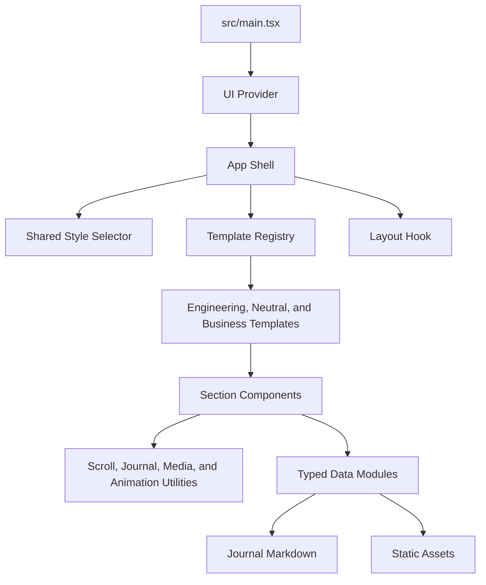

# Code Structure

## Build System

- **Type**: npm scripts with Vite and TypeScript project references.
- **Configuration**:
  - `package.json` defines `dev`, `test`, `build`, `lint`, and `preview`.
  - `vite.config.ts` configures React SWC, Tailwind CSS, TypeScript paths, Vitest, and an environment-driven base path.
  - `tsconfig.app.json` enables strict TypeScript checks for application and test code.
  - `eslint.config.ts` configures base JavaScript, TypeScript, React, and Prettier compatibility.
  - `.github/workflows/deploy.yml` derives the GitHub Pages base path and deploys `dist/`.

## Module Hierarchy

### Text Alternative

`main.tsx` mounts the provider and App. App owns the active runtime template and uses the layout hook, selection utility, and template registry. Each template supplies its shell and maps section IDs to components. Components consume typed data and utilities; data modules import journal Markdown and static assets.

## Existing Files Inventory

### Application and Styling
- `src/main.tsx` - React entrypoint and provider mount.
- `src/App.tsx` - Template, navigation, layout, and journal route orchestration.
- `src/App.css` - Template-scoped variables, backgrounds, and shared animations.
- `src/index.css` - Global variables, document styles, font import, and color mode values.

### Templates
- `src/data/template.ts` - Student-editable initial template selection.
- `src/templates/types.ts` - Template ID, shell, journal, chapter, and complete section-map contracts.
- `src/templates/index.ts` - Three-template registry, source-default compatibility export, resolution, and fallback.
- `src/templates/engineering/index.ts` - Engineering section mapping.
- `src/templates/engineering/EngineeringShell.tsx` - Engineering shell and Navbar integration.
- `src/templates/neutral/*` - Neutral magazine shell plus editorial Hero, About, and Projects.
- `src/templates/business/*` - Business report shell plus executive Hero, About, and Projects.

### Shared and Baseline Components
- `src/components/Navbar.tsx` - Engineering fixed desktop/mobile navigation and display controls.
- `src/components/Hero.tsx` - Engineering hero.
- `src/components/About.tsx` - Biography and metrics.
- `src/components/Education.tsx` - Education records.
- `src/components/Experience.tsx` - Experience timeline.
- `src/components/Awards.tsx` - Awards and recognitions.
- `src/components/Projects.tsx` - Engineering project cards.
- `src/components/Gallery.tsx` - Engineering media gallery and preview.
- `src/components/Journal.tsx` - Combined local and external writing cards.
- `src/components/JournalPostPage.tsx` - Local post detail and not-found states.
- `src/components/Skills.tsx` - Skills and certificate previews.
- `src/components/Contact.tsx` - Contact form and social actions.
- `src/components/shared/PortfolioStyleSelector.tsx` - Shared runtime template menu used by all three shell headers.
- `src/components/shared/*` - Shared section, card, action, logo, and template-selection primitives.
- `src/components/ui/*` - Chakra provider, color mode, tooltip, and toaster helpers.

### Data, Content, Types, and Utilities
- `src/data/*.ts` - Typed student-editable profile, navigation, career, project, media, writing, skill, certificate, and template configuration.
- `src/content/journal/*.md` - Local journal article bodies.
- `src/types/portfolio.ts` - Shared content and section contracts.
- `src/hooks/usePortfolioLayout.ts` - Layout persistence, hash parsing, and section navigation.
- `src/utils/scroll.ts` - Enabled-navigation filtering, active-section tracking, and smooth scrolling.
- `src/utils/journal.ts` - Local journal route creation and parsing.
- `src/utils/media.ts` - YouTube URL helpers.
- `src/utils/animation.ts` - Staggered reveal class selection.
- `src/utils/templateSelection.ts` - Typed template-ID validation and guarded browser persistence.

### Tests and Delivery
- `src/App.test.tsx` - App rendering, runtime template selection, persistence, route, layout, navigation, and journal tests.
- `src/test/data/navigation.test.ts` - Section/navigation configuration tests.
- `src/test/data/portfolio.test.ts` - Portfolio content and link validation tests.
- `src/hooks/usePortfolioLayout.test.ts` - Layout helper tests.
- `src/templates/templateRegistry.test.ts` - Template resolution and section completeness tests.
- `src/utils/templateSelection.test.ts` - Template validation, fallback, persistence, and storage-failure tests.
- `.github/workflows/deploy.yml` - GitHub Pages deployment workflow.
- `README.md` - Student customization and publishing manual.
- `DEPLOYMENT.md` - Detailed deployment guidance.

## Design Patterns

### Registry, Strategy, and Runtime Selection
- **Location**: `src/templates/`.
- **Purpose**: Swap presentation while preserving one content model and current visitor context.
- **Implementation**: Each `PortfolioTemplate` supplies a shell and complete section map; App derives a registry entry from validated runtime state and every shell emits typed choices through one selector.

### Typed Content Configuration
- **Location**: `src/data/` and `src/types/portfolio.ts`.
- **Purpose**: Let students edit content without modifying presentation logic.
- **Implementation**: Section data uses `satisfies` against shared TypeScript types and is aggregated by `portfolio.ts`.

### Hash-Routed Static Navigation
- **Location**: `src/hooks/usePortfolioLayout.ts`, `src/utils/journal.ts`, and `src/App.tsx`.
- **Purpose**: Support direct links and multiple layout modes on GitHub Pages without a server router.
- **Implementation**: Anchor hashes represent single-page sections; `#/section` and `#/journal/slug` represent routed views.

### Shared Section and Action Primitives
- **Location**: `src/components/shared/`.
- **Purpose**: Keep recurring layout, links, logos, template selection, and accessibility behavior consistent.
- **Implementation**: Shared React components receive typed props and CSS-variable styling.

## Critical Dependencies

- **React 19.2.0** - Component rendering, state, effects, and hooks.
- **Chakra UI 3.30.0** - Responsive primitives, controls, drawers, dialogs, and styling props.
- **Vite 7.2.4** - Development server, asset handling, testing integration, and production bundling.
- **Vitest 4.1.9 and Testing Library 16.3.2** - Unit and DOM behavior tests.
- **React Icons 5.5.0** - Navigation, action, social, and status iconography.

## Maintainability Risks

- The shared selector imports registry metadata while shells are registered by that same index; the current ESM cycle is render-safe but should be watched if template definitions gain module-level side effects.
- Neutral and Business intentionally reuse several shared sections, so deep changes to those shared components affect all three presentations.
- `SectionId` and `sectionIds` are maintained separately and require tests to prevent drift.
- There are two ESLint configuration files, which can confuse contributors about the active configuration.
- Template and layout preferences use separate local-storage keys and require regression tests whenever App ownership changes.
